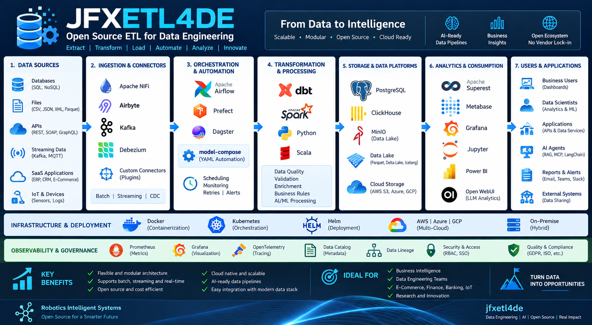

<p align="center">
  
</p>

<p align="center">
  <em>Open-source architecture for Data Engineering, ETL/ELT, streaming, lakehouse, AI agents, analytics, engineering data and digital twins.</em>
</p>


# AI-Powered Data Engineering Platform


## Overview

**JFXETL4DE** is an experimental **AI-powered Data Engineering, Data Integration, Automation, and Analytics platform** built around an open-source technology ecosystem.

The project brings together technologies for:

- ETL and ELT;
- batch and streaming data processing;
- data integration;
- workflow orchestration;
- data lakes and lakehouses;
- analytical databases;
- SQL analysis, translation, and migration;
- database DevOps;
- artificial intelligence and data agents;
- semantic data engineering;
- event-driven architectures;
- serverless computing;
- observability and testing;
- Model-Based Systems Engineering (**MBSE**);
- Computer-Aided Design, Manufacturing, and Simulation (**CAD/CAM/CAS**).

Rather than attempting to replace specialized tools with a single platform, JFXETL4DE provides an **open integration laboratory** for evaluating, combining, and orchestrating complementary technologies.

The long-term objective is to explore the evolution from traditional **ETL pipelines** toward an integrated:

> **Data Engineering + AI Engineering + Agentic Data + Engineering Data platform.**

---

# Vision

JFXETL4DE aims to provide an open architecture where data pipelines, AI agents, analytical workloads, simulation models, and engineering information can participate in the same digital data ecosystem.

```text
                    DATA SOURCES
                         │
                         ▼
                DATA INTEGRATION
                         │
                         ▼
                    ETL / ELT
                         │
              ┌──────────┴──────────┐
              ▼                     ▼
          BATCH DATA          STREAMING DATA
              │                     │
              └──────────┬──────────┘
                         ▼
                    DATA LAKE
                         │
                         ▼
                    LAKEHOUSE
                         │
                         ▼
                  SEMANTIC DATA
                         │
                         ▼
                  AI / AGENTS
                         │
                         ▼
                  DATA PRODUCTS
                         │
              ┌──────────┴──────────┐
              ▼                     ▼
          ENTERPRISE            ENGINEERING
              │                     │
              └──────────┬──────────┘
                         ▼
                    DIGITAL TWIN
```

---

# Objectives

## Main Objective

Design an open and modular platform for building intelligent data pipelines by combining:

```text
Data Sources
      ↓
Integration
      ↓
ETL / ELT
      ↓
Batch / Streaming
      ↓
Lakehouse
      ↓
Semantic Layer
      ↓
AI / Agents
      ↓
Analytics / Data Products
```

## Specific Objectives

- Automate data pipelines.
- Integrate heterogeneous data sources.
- Process batch and streaming workloads.
- Build open lakehouse architectures.
- Automate data workflows.
- Apply AI to enterprise data.
- Introduce data and multi-agent systems.
- Support SQL transformation and migration.
- Separate storage, processing, and consumption layers.
- Enable reproducible deployments.
- Integrate MBSE/CAD/CAM/CAS engineering data.
- Support experimentation with open-source technologies.
- Create a foundation for AI-assisted data engineering.

---

# Conceptual Architecture

```text
┌───────────────────────────────────────────────────────────────┐
│                       DATA SOURCES                            │
│ APIs │ SQL │ Files │ Events │ IoT │ Applications │ Legacy     │
└──────────────────────────────┬────────────────────────────────┘
                               │
                               ▼
┌───────────────────────────────────────────────────────────────┐
│                 DATA INTEGRATION / ETL                        │
│ Apache Camel │ Apache NiFi │ Airbyte │ Pentaho │ n8n          │
└──────────────────────────────┬────────────────────────────────┘
                               │
                               ▼
┌───────────────────────────────────────────────────────────────┐
│                 STREAMING / EVENT PROCESSING                  │
│ Pulsar │ Kafka │ Apache Beam │ Spark │ Hermes │ OpenWhisk     │
└──────────────────────────────┬────────────────────────────────┘
                               │
                               ▼
┌───────────────────────────────────────────────────────────────┐
│                    DATA LAKE / LAKEHOUSE                      │
│ MinIO │ SeaweedFS │ Paimon │ Delta Lake │ Hive │ Dremio       │
└──────────────────────────────┬────────────────────────────────┘
                               │
                               ▼
┌───────────────────────────────────────────────────────────────┐
│                ANALYTICS / SEMANTIC DATA                      │
│ DuckDB │ SAND │ SQLFlow │ SQLing │ Logica │ Coral             │
└──────────────────────────────┬────────────────────────────────┘
                               │
                               ▼
┌───────────────────────────────────────────────────────────────┐
│                     AI DATA PLANE                             │
│ LLM │ Agents │ MindsDB │ Dolly │ Multi-Agent │ RAG            │
└──────────────────────────────┬────────────────────────────────┘
                               │
                               ▼
┌───────────────────────────────────────────────────────────────┐
│                  DATA PRODUCTS / APPLICATIONS                 │
│ BI │ APIs │ ML │ Decision Support │ Automation │ Digital Twin │
└───────────────────────────────────────────────────────────────┘
```

---

# Open-Source Software Compendium

The following technologies represent the main technology families considered by the project.

> **Note:** "Open source" refers to the project/software ecosystem and does not automatically imply that every model, dataset, plugin, dependency, or hosted service has the same licensing terms. Licenses must be reviewed individually before redistribution.

---

## 1. Data Modeling & Reverse Engineering

| Software | Role |
|---|---|
| **CayenneModeler** | Data modeling and reverse engineering |
| **SAND** | Semantic database/table annotation |
| **SQLing** | SQL-to-domain modeling |
| **Apache Hive** | Data warehouse and SQL |
| **DuckDB** | Analytical SQL database |

---

## 2. ETL / ELT / Data Integration

| Software | Role |
|---|---|
| **Pentaho Data Integration** | Visual ETL |
| **Apache NiFi** | Visual dataflow and integration |
| **Apache Camel Karavan** | Integration and workflow design |
| **Airbyte** | Data integration and replication |
| **n8n** | Workflow automation |
| **Apache Beam** | Unified batch and streaming pipelines |
| **Apache DolphinScheduler** | Workflow orchestration |

---

## 3. Streaming & Event-Driven Architecture

| Software | Role |
|---|---|
| **Apache Pulsar** | Distributed messaging and pub/sub |
| **Apache Kafka** | Event streaming |
| **Hermes** | Asynchronous messaging |
| **Apache Beam** | Distributed stream processing |
| **Apache Spark** | Distributed data processing |
| **Oryx 2** | Lambda-style architecture based on Spark/Kafka |

---

## 4. Data Serialization & Transport

| Software | Role |
|---|---|
| **Apache Fory** | High-performance multi-language serialization |
| **Apache Avro** | Schema-based serialization |
| **Protocol Buffers** | Structured data serialization |
| **Apache Arrow** | Columnar analytical data interchange |

---

## 5. Data Lake / Lakehouse

| Software | Role |
|---|---|
| **MinIO** | S3-compatible object storage |
| **SeaweedFS** | Distributed object/file storage |
| **Apache Paimon** | Lakehouse table/storage architecture |
| **Delta Lake** | Open lakehouse storage framework |
| **Apache Hive** | Data warehouse |
| **Dremio** | Lakehouse query and data platform |

---

## 6. SQL Engineering

| Software | Role |
|---|---|
| **SQLFlow** | SQL-to-workflow execution |
| **SQLing** | SQL-to-domain modeling |
| **Coral** | SQL analysis, translation, and rewriting |
| **Logica** | Declarative logic programming |
| **SQLines** | Database and SQL migration |
| **Babelfish for PostgreSQL** | SQL Server compatibility for PostgreSQL |

---

## 7. Database DevOps

| Software | Role |
|---|---|
| **Flyway** | Database schema migrations |
| **Obevo** | Database deployment |
| **Bytebase** | Database DevOps and change management |
| **SQLines** | Database migration |
| **Babelfish** | Database compatibility |

---

# AI & Agentic Data Engineering

## 8. Artificial Intelligence

The AI layer provides intelligent assistance across the data engineering lifecycle.

| Technology | Role |
|---|---|
| **Dolly** | Open model ecosystem |
| **MindsDB** | AI/ML integration with data |
| **OWL** | Multi-agent collaboration |
| **LangChain** | LLM application orchestration |
| **LangGraph** | Stateful agent workflows |
| **Ollama** | Local LLM execution |
| **Open WebUI** | Local AI user interface |
| **Qdrant** | Vector database and RAG |

The architecture can prioritize **local and self-hosted AI models** to reduce dependency on proprietary AI services and support reproducible experimentation.

---

# 9. Agentic Data Platform

JFXETL4DE can introduce specialized AI agents for data engineering activities.

```text
                    ┌────────────────────┐
                    │     AI Gateway     │
                    └─────────┬──────────┘
                              │
             ┌────────────────┼────────────────┐
             ▼                ▼                ▼
        Data Agent        SQL Agent        ETL Agent
             │                │                │
             ▼                ▼                ▼
        RAG / Vector       SQL Engine       Workflow
             │                │                │
             └────────────────┼────────────────┘
                              ▼
                    Data Engineering Platform
```

Potential agent capabilities include:

- pipeline generation;
- SQL generation and transformation;
- data profiling;
- metadata generation;
- data documentation;
- anomaly detection;
- transformation recommendation;
- code generation;
- database migration;
- semantic analysis;
- troubleshooting;
- pipeline optimization;
- natural-language data exploration.

---

# AI-Assisted ETL Lifecycle

```text
              User Requirement
                     │
                     ▼
              AI Data Analyst
                     │
                     ▼
              Data Profiling
                     │
                     ▼
             Pipeline Designer
                     │
                     ▼
              ETL Generation
                     │
                     ▼
              Data Validation
                     │
                     ▼
             Human Approval
                     │
                     ▼
              Pipeline Deploy
                     │
                     ▼
                Monitoring
                     │
                     ▼
              Continuous AI
               Optimization
```

Human approval remains an important control point for production workloads.

---

# Simulation & Engineering Data

JFXETL4DE can be extended beyond conventional data engineering into **engineering data pipelines and simulation workflows**.

## 10. Simulation / Scientific Computing

| Technology | Role |
|---|---|
| **λ-Sim** | Simulation models exposed through APIs |
| **Modelica ecosystem** | Multi-domain system modeling |
| **OpenModelica** | Open-source Modelica environment |
| **SciML** | Scientific machine learning and differential equations |
| **FMI** | Model exchange and co-simulation |

This creates a potential path from:

```text
Enterprise Data
      ↓
Engineering Data
      ↓
ETL / Integration
      ↓
Simulation
      ↓
AI Analysis
      ↓
Digital Twin
```

---

# MBSE / CAD / CAM / CAS

The engineering integration layer is organized around four major domains:

```text
MBSE
 ├── System Architecture
 ├── Requirements
 └── System Models

CAD
 └── Computer-Aided Design

CAM
 └── Computer-Aided Manufacturing

CAS
 └── Computer-Aided Simulation / Analysis
```

The objective is to establish a **digital thread** between engineering models and operational data.

```text
System Model
     ↓
Engineering Data
     ↓
Data Integration
     ↓
Simulation
     ↓
AI Analysis
     ↓
Digital Twin
     ↓
Operational Data
     └───────────────┐
                     │
                     └── Feedback Loop
```

---

# Data Governance

A production-oriented implementation should progressively incorporate:

- Data Quality;
- Data Catalog;
- Data Lineage;
- Data Contracts;
- Schema Registry;
- Metadata Management;
- Data Classification;
- Access Control;
- Audit Logs;
- Privacy;
- Security;
- Reproducibility.

---

# Observability

The platform should provide observability across both data and AI workloads.

```text
Applications
     │
     ├── Logs
     ├── Metrics
     └── Traces
          │
          ▼
   Observability Layer
          │
     ┌────┼────┐
     ▼    ▼    ▼
 Monitoring Alerts Dashboards
```

Potential monitoring domains:

- infrastructure;
- ETL pipelines;
- workflows;
- streaming;
- data quality;
- databases;
- AI models;
- AI agents;
- RAG pipelines;
- lakehouse workloads.

---

# Deployment Architecture

The platform is designed to support progressive deployment.

```text
Local Development
       │
       ▼
Docker
       │
       ▼
Docker Compose
       │
       ▼
Kubernetes
       │
       ├── On-Premises
       ├── Private Cloud
       ├── Public Cloud
       └── Hybrid Cloud
```

Recommended infrastructure technologies include:

```text
Linux
Docker
Docker Compose
Kubernetes
Python
Java
Scala
SQL
Node.js
Git
```

---

# Installation

## Prerequisites

A development environment should provide:

- Linux or compatible development environment;
- Git;
- Docker;
- Docker Compose;
- Python;
- Java;
- SQL tooling.

For distributed deployments:

- Kubernetes;
- container registry;
- persistent storage;
- observability stack.

## Clone the repository

```bash
git clone https://github.com/robotics-intelligent-systems/jfxetl4de.git

cd jfxetl4de
```

If a Docker Compose configuration is provided by the selected implementation:

```bash
docker compose up -d
```

> Deployment commands should be adapted to the specific modules and configuration files included in the current project version.

---

# Proposed Repository Structure

```text
jfxetl4de/
│
├── README.md
├── LICENSE
├── CONTRIBUTING.md
├── CODE_OF_CONDUCT.md
│
├── docs/
│   ├── architecture/
│   ├── data-engineering/
│   ├── ai/
│   ├── lakehouse/
│   ├── streaming/
│   └── mbse/
│
├── etl/
├── streaming/
├── lakehouse/
├── sql/
├── ai/
├── agents/
├── governance/
├── observability/
│
├── MBSE/
├── CAD/
├── CAM/
└── CAS/
```

---

# Use Cases

## Data Engineering

- Enterprise ETL.
- ELT.
- Data integration.
- Data migration.
- Data pipelines.
- Data lakes.
- Lakehouses.
- Data quality.

## AI Engineering

- AI-assisted ETL.
- Natural-language SQL.
- Data agents.
- RAG over enterprise data.
- Automated data profiling.
- AI-assisted data quality.
- AI-assisted pipeline optimization.

## Enterprise Integration

- APIs.
- Event-driven systems.
- Microservices.
- Legacy integration.
- Database migration.
- Workflow automation.

## Engineering

- Engineering data management.
- Simulation data pipelines.
- Digital twins.
- MBSE.
- CAD/CAM/CAS integration.
- Engineering analytics.

---

# Development Roadmap

## Phase 1 — Foundation

- [ ] Repository structure
- [ ] Documentation
- [ ] Docker development environment
- [ ] Initial ETL pipeline
- [ ] Initial data model

## Phase 2 — Data Platform

- [ ] Streaming integration
- [ ] Object storage
- [ ] Lakehouse
- [ ] SQL analytics
- [ ] Data catalog
- [ ] Data quality

## Phase 3 — AI Data Engineering

- [ ] Local LLM runtime
- [ ] RAG
- [ ] Vector database
- [ ] Data Agent
- [ ] SQL Agent
- [ ] ETL Agent

## Phase 4 — Agentic Platform

- [ ] Multi-agent orchestration
- [ ] Tool calling
- [ ] MCP integration
- [ ] Automated pipeline generation
- [ ] AI-assisted troubleshooting
- [ ] Human-in-the-loop approval

## Phase 5 — Engineering Data

- [ ] Simulation integration
- [ ] Modelica/FMI
- [ ] Digital Twin
- [ ] MBSE integration
- [ ] CAD/CAM/CAS data pipelines
- [ ] Engineering digital thread

---

# Contribution Guidelines

Contributions are welcome in the following areas:

1. Issues and bug reports.
2. Feature requests.
3. Pull requests.
4. Documentation.
5. Data pipeline examples.
6. New open-source integrations.
7. Performance benchmarks.
8. Interoperability tests.
9. AI agent implementations.
10. Engineering-data integrations.

When introducing a new dependency, document:

- project name;
- version;
- license;
- purpose;
- integration mechanism;
- runtime requirements;
- maintenance status;
- security considerations;
- interoperability characteristics.

---

# Dependency Selection Criteria

Candidate technologies should be evaluated according to:

| Criterion | Description |
|---|---|
| **Open Source** | Source code availability |
| **License** | License compatibility |
| **Interoperability** | APIs and open standards |
| **Documentation** | Technical documentation quality |
| **Community** | Community activity |
| **Security** | Security posture |
| **Performance** | Runtime performance |
| **Scalability** | Horizontal/vertical scalability |
| **Containerization** | Docker/Kubernetes support |
| **AI Integration** | AI/LLM integration capability |
| **Maintainability** | Long-term sustainability |

---

# Architecture Principles

JFXETL4DE follows several architectural principles:

### 1. Open Technology First

Prefer open-source technologies and open standards whenever technically and economically viable.

### 2. Modular Architecture

Components should be replaceable without redesigning the entire platform.

### 3. Interoperability

Favor:

- REST;
- gRPC;
- SQL;
- Apache Arrow;
- Apache Avro;
- Kafka-compatible protocols;
- S3-compatible storage;
- OpenAPI;
- FMI;
- MCP;
- other open standards.

### 4. AI as an Engineering Capability

AI should augment data engineers rather than simply become another isolated application.

### 5. Human-in-the-Loop

Production-critical transformations should support review, approval, auditability, and rollback.

### 6. Reproducibility

Infrastructure and pipelines should be reproducible through version-controlled configuration and containerized environments.

### 7. Data-Centric Architecture

Data contracts, schemas, metadata, lineage, quality, and governance should be treated as first-class architectural concerns.

---

# Security

Security should be addressed throughout the platform lifecycle:

```text
Identity
   ↓
Authentication
   ↓
Authorization
   ↓
Secrets Management
   ↓
Data Protection
   ↓
Pipeline Security
   ↓
AI Security
   ↓
Audit
```

Particular attention should be given to:

- credentials;
- secrets;
- personally identifiable information;
- data access;
- model access;
- prompt injection;
- agent tool permissions;
- supply-chain security;
- container vulnerabilities;
- dependency vulnerabilities.

---

# Licensing

Each dependency retains its own license.

Before distributing a complete JFXETL4DE-based solution, review compatibility among:

- project license;
- dependency licenses;
- AI model licenses;
- dataset licenses;
- documentation licenses;
- container/image licenses.

**Open source does not mean that every dependency has identical licensing terms.**

A formal Software Bill of Materials (**SBOM**) is recommended for production distributions.

---

# Project Information

## Main Repository

**JFXETL4DE — AI-Powered Data Engineering Platform**

https://github.com/robotics-intelligent-systems/jfxetl4de

## Repository Template

**Plantilla-de-repositorio — sdk2035**

https://github.com/sdk2035/Plantilla-de-repositorio

The documentation structure proposed here combines the technical scope of JFXETL4DE with the professional repository-documentation approach represented by the `sdk2035/Plantilla-de-repositorio` project.

---

# Final Architecture Summary

JFXETL4DE explores the convergence of:

```text
                    ┌─────────────────────┐
                    │   DATA ENGINEERING  │
                    └──────────┬──────────┘
                               │
              ┌────────────────┼────────────────┐
              │                │                │
              ▼                ▼                ▼
           ETL/ELT         STREAMING        LAKEHOUSE
              │                │                │
              └────────────────┼────────────────┘
                               │
                               ▼
                       SEMANTIC DATA
                               │
                               ▼
                         AI / AGENTS
                               │
                               ▼
                        DATA PRODUCTS
                               │
              ┌────────────────┴────────────────┐
              │                                 │
              ▼                                 ▼
         ENTERPRISE                       ENGINEERING
              │                                 │
              └────────────────┬────────────────┘
                               │
                               ▼
                         DIGITAL TWIN
                               │
                               ▼
                     CONTINUOUS FEEDBACK
```

The resulting architecture provides a foundation for experimentation with **open-source Data Engineering, AI Engineering, Agentic AI, Lakehouse architectures, scientific computing, simulation, MBSE, CAD/CAM/CAS, and Digital Twins**.

The core principle is to build an ecosystem where specialized open technologies can be integrated through well-defined interfaces rather than forcing all workloads into a single monolithic platform.
