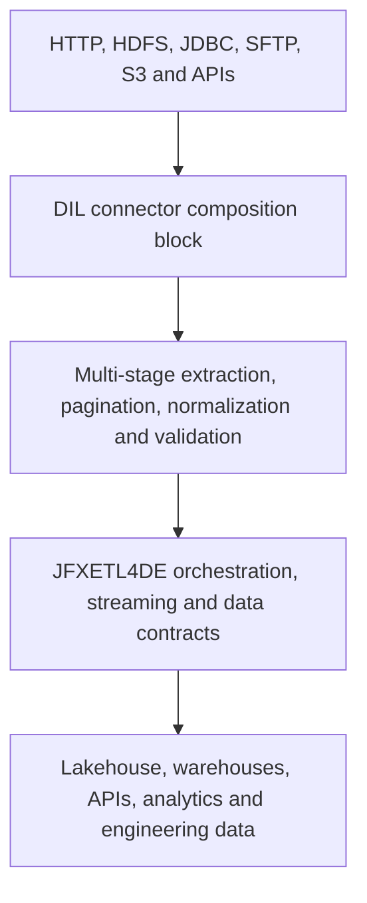

<p align="center">
  
</p>

<p align="center">
  <em>Open-source architecture for Data Engineering, ETL/ELT, streaming, lakehouse, AI agents, analytics, engineering data and digital twins.</em>
</p>


# AI-Powered Data Engineering and Data Integration Platform


## Overview

**JFXETL4DE** is an experimental **AI-powered Data Engineering, Data Integration, Automation, and Analytics platform** built around an open-source technology ecosystem.

The project brings together technologies for:

- ETL and ELT;
- batch and streaming data processing;
- data integration;
- workflow orchestration;
- data lakes and lakehouses;
- analytical databases;
- SQL analysis, translation, and migration;
- database DevOps;
- artificial intelligence and data agents;
- semantic data engineering;
- event-driven architectures;
- serverless computing;
- observability and testing;
- Model-Based Systems Engineering (**MBSE**);
- Computer-Aided Design, Manufacturing, and Simulation (**CAD/CAM/CAS**).

Rather than attempting to replace specialized tools with a single platform, JFXETL4DE provides an **open integration laboratory** for evaluating, combining, and orchestrating complementary technologies.

The long-term objective is to explore the evolution from traditional **ETL pipelines** toward an integrated:

> **Data Engineering + AI Engineering + Agentic Data + Engineering Data platform.**

---

## Integrated development block: Data Integration Library

JFXETL4DE adopts [`sdk2035/data-integration-library`](https://github.com/sdk2035/data-integration-library) as an optional connector-composition block for the Data Engineering, ETL/ELT and enterprise-integration layers. The component repository contains the LinkedIn Data Integration Library (DIL), a collection of generic protocol and data-format components that can be composed into connectors for cloud services, APIs, files and databases. Its upstream README describes use with data-integration frameworks such as [Apache Gobblin](https://gobblin.apache.org/) and event-processing systems such as [Apache Kafka](https://kafka.apache.org/).

The block complements the broader JFXETL4DE compendium. JFXETL4DE remains responsible for pipeline design, data contracts, quality, lineage, lakehouse storage, streaming integration, AI agents, observability and deployment. DIL is responsible for reusable source/extractor, processor, converter and target-side connector behavior. Neither project is replaced by the other.

### Capabilities brought into JFXETL4DE

- **Protocol and format separation.** Protocol-oriented source classes can be combined with format and processing components without hard-wiring every cloud API to one data format.
- **Multi-stage integration.** A job can list, prepare, partition, extract, normalize, validate, compress or encrypt data across multiple stages.
- **Bidirectional flows.** Ingress and egress use the same component model, so the same integration contract can move data into or out of a system.
- **Connector coverage.** The documented source layer includes HTTP, HDFS, JDBC, SFTP and S3-oriented sources. Documented component pages include Avro, CSV, JSON, file-dump, gzip, validation, normalization and S3 processing.
- **Large-data controls.** Flexible pagination, work units, backfill, watermarks, asynchronous ingestion and two-step download/ingestion patterns help break large transfers into observable tasks.
- **Extensible protection.** Compression and encryption are pluggable stages. Secret handling, key management and access policy remain JFXETL4DE deployment responsibilities.

### Reference flow



AI agents, RAG and data-quality services may propose or validate configuration around this flow. Execution remains controlled by a reviewed pipeline definition, credential policy and human-approved release.

### Responsibility boundary

| Area | Data Integration Library block | JFXETL4DE platform |
|---|---|---|
| Source access | Protocol-specific connections and extractors | Credential policy, secret references, network policy and provider ownership |
| Data movement | Work units, pagination, staged transfer and egress behavior | Scheduling, retry policy, event routing, dead-letter handling and reconciliation |
| Format and processing | Extractor, converter, normalizer, validation, compression and encryption extension points | Canonical schemas, data contracts, quality rules, classification and lineage |
| Consumption | Connector output to a downstream framework or target | Lakehouse, streaming, analytics, AI/RAG, simulation and engineering-data products |
| Operations | Component logs and task status exposed by the adapter | Metrics, traces, alerts, cost controls, model evaluation and incident response |

### Integration contract

The adapter should expose DIL jobs through a stable JFXETL4DE envelope. The envelope carries control metadata while the payload remains owned by the selected extractor or converter.

```yaml
run_id: unique-run-identifier
work_unit_id: partition-or-page-identifier
source:
  protocol: http|hdfs|jdbc|sftp|s3
  connector: implementation-name
  resource: logical-resource-reference
stage: list|prepare|extract|convert|validate|egress
schema_version: contract-version
event_time: source-event-time
ingest_time: platform-ingest-time
payload_ref: object-or-stream-reference
checksum: content-integrity-value
quality_state: pending|passed|quarantined|failed
provenance: source-and-transformation-record
security_classification: public|internal|confidential|restricted
```

The adapter must be idempotent for a `(run_id, work_unit_id, stage)` key, preserve provider request identifiers, and distinguish `pending`, `ready`, `processed`, `quarantined`, `failed` and `cancelled`. A failed work unit can be retried without falsely marking the complete dataset as successful.

### Patterns to implement first

1. **Asynchronous ingestion:** submit a provider preparation request, persist its tracking identifier, poll or receive a status update, and extract when the provider reports readiness.
2. **Two-step file download:** list objects into a staging manifest, then download each object with independent checksums and retry state.
3. **Two-step large ingestion:** extract a bounded set of partition values, create work units, then ingest partitions in parallel or over recurring runs.
4. **Validated egress:** send normalized records to an API or data service, track the response and retain rejected records for review.

These patterns are documented by DIL and map directly to JFXETL4DE requirements for repeatability, backfill, quality and lineage. The implementation should cite the relevant DIL guide and add an integration test for each pattern.

### Runtime and build compatibility

The component repository is Gradle-based, includes the `cdi-core` subproject and publishes version `0.2.119` in its current `version.properties`. Its README requires **JDK 8** and states that JDK 11 or later is not supported. This is a compatibility constraint to verify in CI, not a promise about future releases.

JFXETL4DE can integrate the block in three ways:

| Option | When to use | Trade-off |
|---|---|---|
| In-process Java adapter | The selected JFXETL4DE runtime can execute the DIL-compatible Java level | Lowest latency, tighter dependency coupling |
| Dedicated connector worker | The main platform uses a newer JVM or another language | Clear isolation and independent rollout, with a protocol boundary |
| Maintained compatibility branch | A long-term product requires newer runtime support | More maintenance, tests and upstream coordination |

The MVP should use a dedicated adapter or worker until a reproducible build confirms runtime compatibility. The adapter must not silently claim that a provider API is supported when the current implementation only performs a documented handoff.

### AI-assisted data engineering around DIL

The JFXETL4DE AI layer may provide:

- natural-language generation of a draft DIL job from an approved source and target contract;
- mapping suggestions between source fields and a versioned canonical schema;
- pagination, partition and work-unit recommendations based on observed volumes;
- data-quality explanations and quarantine summaries;
- RAG answers grounded in DIL component guides, JFXETL4DE contracts and provider documentation;
- impact analysis for schema, connector or dependency changes.

Agents must not receive raw secrets, invent connector capabilities, bypass validation, change retention policy or publish a pipeline without an approval record. Every generated configuration stores model, prompt, source documents, reviewer, test result and release version.

### Observability and failure handling

Each DIL-backed task should emit `run_id`, `work_unit_id`, connector, stage, source, target, record count, byte count, latency, retry count, provider request ID, checksum result and final state. JFXETL4DE aggregates these signals into pipeline-level dashboards for throughput, freshness, completeness, quality, cost and failure recovery.

Required failure paths include expired credentials, provider throttling, pagination gaps, duplicate pages, malformed records, schema drift, checksum mismatch, encryption failure, partial egress, lost status updates and unavailable downstream storage. Quarantine and replay must preserve provenance.

### License and dependency policy

The component repository includes the [BSD 2-Clause license](https://github.com/sdk2035/data-integration-library/blob/master/LICENSE) and a [NOTICE](https://github.com/sdk2035/data-integration-library/blob/master/NOTICE) referring to LinkedIn Corporation. JFXETL4DE must preserve those notices when distributing the block, document the integration version and publish an SBOM. Every transitive dependency, model, dataset, container and connector must be reviewed separately; the BSD 2-Clause license does not make all surrounding components identical.

### Delivery plan

| Phase | Deliverable | Exit criterion |
|---|---|---|
| 1. Compatibility spike | Build `cdi-core` under the documented JDK/Gradle constraints and wrap one source plus one converter | Reproducible CI build, license inventory and one end-to-end fixture |
| 2. Contract adapter | Implement the JFXETL4DE envelope, idempotency, provenance, metrics and quarantine | Async, two-step file and partitioned-ingestion tests pass |
| 3. Platform integration | Connect the adapter to the selected orchestrator, Kafka-compatible bus or lakehouse target | Replay, backfill, schema drift and partial failure are observable |
| 4. AI assistance | Add RAG-grounded job drafting, mapping suggestions and data-quality explanations | Human approval, source citations, refusal and rollback tests pass |
| 5. Production hardening | Isolate secrets, add SLOs, SBOM, security scanning, capacity tests and provider runbooks | Operational owner signs off before any production connector is enabled |

### Open decisions

- Select the first source/target pair and confirm that its API, file or database terms permit the intended use.
- Choose in-process Java 8 execution or a dedicated connector worker based on the host runtime.
- Define the canonical schema and the schema-registry strategy for Avro, JSON and columnar interchange.
- Decide whether Kafka-compatible events, an outbox or direct orchestration carries status updates in the MVP.
- Assign owners for credentials, data quality, incident response, license review and provider reconciliation.
- Add the DIL version, source commit, patches and test results to the JFXETL4DE dependency register.

### Source references

- [JFXETL4DE — AI-Powered Data Engineering Platform](https://github.com/robotics-intelligent-systems/jfxetl4de)
- [JFXETL4DE README](https://github.com/robotics-intelligent-systems/jfxetl4de/blob/main/README.md)
- [Data Integration Library component repository](https://github.com/sdk2035/data-integration-library)
- [Data Integration Library README](https://github.com/sdk2035/data-integration-library/blob/master/README.md)
- [DIL component guide](https://github.com/sdk2035/data-integration-library/tree/master/docs/components)
- [DIL flow design patterns](https://github.com/sdk2035/data-integration-library/tree/master/docs/patterns)

---

# Vision

JFXETL4DE aims to provide an open architecture where data pipelines, AI agents, analytical workloads, simulation models, and engineering information can participate in the same digital data ecosystem.

```text
                    DATA SOURCES
                         │
                         ▼
                DATA INTEGRATION
                         │
                         ▼
                    ETL / ELT
                         │
              ┌──────────┴──────────┐
              ▼                     ▼
          BATCH DATA          STREAMING DATA
              │                     │
              └──────────┬──────────┘
                         ▼
                    DATA LAKE
                         │
                         ▼
                    LAKEHOUSE
                         │
                         ▼
                  SEMANTIC DATA
                         │
                         ▼
                  AI / AGENTS
                         │
                         ▼
                  DATA PRODUCTS
                         │
              ┌──────────┴──────────┐
              ▼                     ▼
          ENTERPRISE            ENGINEERING
              │                     │
              └──────────┬──────────┘
                         ▼
                    DIGITAL TWIN
```

---

# Objectives

## Main Objective

Design an open and modular platform for building intelligent data pipelines by combining:

```text
Data Sources
      ↓
Integration
      ↓
ETL / ELT
      ↓
Batch / Streaming
      ↓
Lakehouse
      ↓
Semantic Layer
      ↓
AI / Agents
      ↓
Analytics / Data Products
```

## Specific Objectives

- Automate data pipelines.
- Integrate heterogeneous data sources.
- Process batch and streaming workloads.
- Build open lakehouse architectures.
- Automate data workflows.
- Apply AI to enterprise data.
- Introduce data and multi-agent systems.
- Support SQL transformation and migration.
- Separate storage, processing, and consumption layers.
- Enable reproducible deployments.
- Integrate MBSE/CAD/CAM/CAS engineering data.
- Support experimentation with open-source technologies.
- Create a foundation for AI-assisted data engineering.

---

# Conceptual Architecture

```text
┌───────────────────────────────────────────────────────────────┐
│                       DATA SOURCES                            │
│ APIs │ SQL │ Files │ Events │ IoT │ Applications │ Legacy     │
└──────────────────────────────┬────────────────────────────────┘
                               │
                               ▼
┌───────────────────────────────────────────────────────────────┐
│                 DATA INTEGRATION / ETL                        │
│ Apache Camel │ Apache NiFi │ Airbyte │ Pentaho │ n8n          │
└──────────────────────────────┬────────────────────────────────┘
                               │
                               ▼
┌───────────────────────────────────────────────────────────────┐
│                 STREAMING / EVENT PROCESSING                  │
│ Pulsar │ Kafka │ Apache Beam │ Spark │ Hermes │ OpenWhisk     │
└──────────────────────────────┬────────────────────────────────┘
                               │
                               ▼
┌───────────────────────────────────────────────────────────────┐
│                    DATA LAKE / LAKEHOUSE                      │
│ MinIO │ SeaweedFS │ Paimon │ Delta Lake │ Hive │ Dremio       │
└──────────────────────────────┬────────────────────────────────┘
                               │
                               ▼
┌───────────────────────────────────────────────────────────────┐
│                ANALYTICS / SEMANTIC DATA                      │
│ DuckDB │ SAND │ SQLFlow │ SQLing │ Logica │ Coral             │
└──────────────────────────────┬────────────────────────────────┘
                               │
                               ▼
┌───────────────────────────────────────────────────────────────┐
│                     AI DATA PLANE                             │
│ LLM │ Agents │ MindsDB │ Dolly │ Multi-Agent │ RAG            │
└──────────────────────────────┬────────────────────────────────┘
                               │
                               ▼
┌───────────────────────────────────────────────────────────────┐
│                  DATA PRODUCTS / APPLICATIONS                 │
│ BI │ APIs │ ML │ Decision Support │ Automation │ Digital Twin │
└───────────────────────────────────────────────────────────────┘
```

---

# Open-Source Software Compendium

The following technologies represent the main technology families considered by the project.

> **Note:** "Open source" refers to the project/software ecosystem and does not automatically imply that every model, dataset, plugin, dependency, or hosted service has the same licensing terms. Licenses must be reviewed individually before redistribution.

---

## 1. Data Modeling & Reverse Engineering

| Software | Role |
|---|---|
| **CayenneModeler** | Data modeling and reverse engineering |
| **SAND** | Semantic database/table annotation |
| **SQLing** | SQL-to-domain modeling |
| **Apache Hive** | Data warehouse and SQL |
| **DuckDB** | Analytical SQL database |

---

## 2. ETL / ELT / Data Integration

| Software | Role |
|---|---|
| **Pentaho Data Integration** | Visual ETL |
| **Apache NiFi** | Visual dataflow and integration |
| **Apache Camel Karavan** | Integration and workflow design |
| **Airbyte** | Data integration and replication |
| **Data Integration Library (DIL)** | Composable protocol, extractor, converter and multi-stage connector block |
| **n8n** | Workflow automation |
| **Apache Beam** | Unified batch and streaming pipelines |
| **Apache DolphinScheduler** | Workflow orchestration |

---

## 3. Streaming & Event-Driven Architecture

| Software | Role |
|---|---|
| **Apache Pulsar** | Distributed messaging and pub/sub |
| **Apache Kafka** | Event streaming |
| **Hermes** | Asynchronous messaging |
| **Apache Beam** | Distributed stream processing |
| **Apache Spark** | Distributed data processing |
| **Oryx 2** | Lambda-style architecture based on Spark/Kafka |

---

## 4. Data Serialization & Transport

| Software | Role |
|---|---|
| **Apache Fory** | High-performance multi-language serialization |
| **Apache Avro** | Schema-based serialization |
| **Protocol Buffers** | Structured data serialization |
| **Apache Arrow** | Columnar analytical data interchange |

---

## 5. Data Lake / Lakehouse

| Software | Role |
|---|---|
| **MinIO** | S3-compatible object storage |
| **SeaweedFS** | Distributed object/file storage |
| **Apache Paimon** | Lakehouse table/storage architecture |
| **Delta Lake** | Open lakehouse storage framework |
| **Apache Hive** | Data warehouse |
| **Dremio** | Lakehouse query and data platform |

---

## 6. SQL Engineering

| Software | Role |
|---|---|
| **SQLFlow** | SQL-to-workflow execution |
| **SQLing** | SQL-to-domain modeling |
| **Coral** | SQL analysis, translation, and rewriting |
| **Logica** | Declarative logic programming |
| **SQLines** | Database and SQL migration |
| **Babelfish for PostgreSQL** | SQL Server compatibility for PostgreSQL |

---

## 7. Database DevOps

| Software | Role |
|---|---|
| **Flyway** | Database schema migrations |
| **Obevo** | Database deployment |
| **Bytebase** | Database DevOps and change management |
| **SQLines** | Database migration |
| **Babelfish** | Database compatibility |

---

# AI & Agentic Data Engineering

## 8. Artificial Intelligence

The AI layer provides intelligent assistance across the data engineering lifecycle.

| Technology | Role |
|---|---|
| **Dolly** | Open model ecosystem |
| **MindsDB** | AI/ML integration with data |
| **OWL** | Multi-agent collaboration |
| **LangChain** | LLM application orchestration |
| **LangGraph** | Stateful agent workflows |
| **Ollama** | Local LLM execution |
| **Open WebUI** | Local AI user interface |
| **Qdrant** | Vector database and RAG |

The architecture can prioritize **local and self-hosted AI models** to reduce dependency on proprietary AI services and support reproducible experimentation.

---

# 9. Agentic Data Platform

JFXETL4DE can introduce specialized AI agents for data engineering activities.

```text
                    ┌────────────────────┐
                    │     AI Gateway     │
                    └─────────┬──────────┘
                              │
             ┌────────────────┼────────────────┐
             ▼                ▼                ▼
        Data Agent        SQL Agent        ETL Agent
             │                │                │
             ▼                ▼                ▼
        RAG / Vector       SQL Engine       Workflow
             │                │                │
             └────────────────┼────────────────┘
                              ▼
                    Data Engineering Platform
```

Potential agent capabilities include:

- pipeline generation;
- SQL generation and transformation;
- data profiling;
- metadata generation;
- data documentation;
- anomaly detection;
- transformation recommendation;
- code generation;
- database migration;
- semantic analysis;
- troubleshooting;
- pipeline optimization;
- natural-language data exploration.

---

# AI-Assisted ETL Lifecycle

```text
              User Requirement
                     │
                     ▼
              AI Data Analyst
                     │
                     ▼
              Data Profiling
                     │
                     ▼
             Pipeline Designer
                     │
                     ▼
              ETL Generation
                     │
                     ▼
              Data Validation
                     │
                     ▼
             Human Approval
                     │
                     ▼
              Pipeline Deploy
                     │
                     ▼
                Monitoring
                     │
                     ▼
              Continuous AI
               Optimization
```

Human approval remains an important control point for production workloads.

---

# Simulation & Engineering Data

JFXETL4DE can be extended beyond conventional data engineering into **engineering data pipelines and simulation workflows**.

## 10. Simulation / Scientific Computing

| Technology | Role |
|---|---|
| **λ-Sim** | Simulation models exposed through APIs |
| **Modelica ecosystem** | Multi-domain system modeling |
| **OpenModelica** | Open-source Modelica environment |
| **SciML** | Scientific machine learning and differential equations |
| **FMI** | Model exchange and co-simulation |

This creates a potential path from:

```text
Enterprise Data
      ↓
Engineering Data
      ↓
ETL / Integration
      ↓
Simulation
      ↓
AI Analysis
      ↓
Digital Twin
```

---

# MBSE / CAD / CAM / CAS

The engineering integration layer is organized around four major domains:

```text
MBSE
 ├── System Architecture
 ├── Requirements
 └── System Models

CAD
 └── Computer-Aided Design

CAM
 └── Computer-Aided Manufacturing

CAS
 └── Computer-Aided Simulation / Analysis
```

The objective is to establish a **digital thread** between engineering models and operational data.

```text
System Model
     ↓
Engineering Data
     ↓
Data Integration
     ↓
Simulation
     ↓
AI Analysis
     ↓
Digital Twin
     ↓
Operational Data
     └───────────────┐
                     │
                     └── Feedback Loop
```

---

# Data Governance

A production-oriented implementation should progressively incorporate:

- Data Quality;
- Data Catalog;
- Data Lineage;
- Data Contracts;
- Schema Registry;
- Metadata Management;
- Data Classification;
- Access Control;
- Audit Logs;
- Privacy;
- Security;
- Reproducibility.

---

# Observability

The platform should provide observability across both data and AI workloads.

```text
Applications
     │
     ├── Logs
     ├── Metrics
     └── Traces
          │
          ▼
   Observability Layer
          │
     ┌────┼────┐
     ▼    ▼    ▼
 Monitoring Alerts Dashboards
```

Potential monitoring domains:

- infrastructure;
- ETL pipelines;
- workflows;
- streaming;
- data quality;
- databases;
- AI models;
- AI agents;
- RAG pipelines;
- lakehouse workloads.

---

# Deployment Architecture

The platform is designed to support progressive deployment.

```text
Local Development
       │
       ▼
Docker
       │
       ▼
Docker Compose
       │
       ▼
Kubernetes
       │
       ├── On-Premises
       ├── Private Cloud
       ├── Public Cloud
       └── Hybrid Cloud
```

Recommended infrastructure technologies include:

```text
Linux
Docker
Docker Compose
Kubernetes
Python
Java
Scala
SQL
Node.js
Git
```

---

# Installation

## Prerequisites

A development environment should provide:

- Linux or compatible development environment;
- Git;
- Docker;
- Docker Compose;
- Python;
- Java;
- SQL tooling.

For distributed deployments:

- Kubernetes;
- container registry;
- persistent storage;
- observability stack.

## Clone the repository

```bash
git clone https://github.com/robotics-intelligent-systems/jfxetl4de.git

cd jfxetl4de
```

If a Docker Compose configuration is provided by the selected implementation:

```bash
docker compose up -d
```

> Deployment commands should be adapted to the specific modules and configuration files included in the current project version.

---

# Proposed Repository Structure

```text
jfxetl4de/
│
├── README.md
├── LICENSE
├── CONTRIBUTING.md
├── CODE_OF_CONDUCT.md
│
├── docs/
│   ├── architecture/
│   ├── data-engineering/
│   ├── ai/
│   ├── lakehouse/
│   ├── streaming/
│   └── mbse/
│
├── integrations/
│   └── data-integration-library/
├── etl/
├── streaming/
├── lakehouse/
├── sql/
├── ai/
├── agents/
├── governance/
├── observability/
│
├── MBSE/
├── CAD/
├── CAM/
└── CAS/
```

---

# Use Cases

## Data Engineering

- Enterprise ETL.
- ELT.
- Data integration.
- Data migration.
- Data pipelines.
- Data lakes.
- Lakehouses.
- Data quality.

## AI Engineering

- AI-assisted ETL.
- Natural-language SQL.
- Data agents.
- RAG over enterprise data.
- Automated data profiling.
- AI-assisted data quality.
- AI-assisted pipeline optimization.

## Enterprise Integration

- APIs.
- Event-driven systems.
- Microservices.
- Legacy integration.
- Database migration.
- Workflow automation.

## Engineering

- Engineering data management.
- Simulation data pipelines.
- Digital twins.
- MBSE.
- CAD/CAM/CAS integration.
- Engineering analytics.

---

# Development Roadmap

## Phase 1 — Foundation

- [ ] Repository structure
- [ ] Documentation
- [ ] Docker development environment
- [ ] Initial ETL pipeline
- [ ] Initial data model

## Phase 2 — Data Platform

- [ ] Streaming integration
- [ ] Object storage
- [ ] Lakehouse
- [ ] SQL analytics
- [ ] Data catalog
- [ ] Data quality

## Phase 3 — AI Data Engineering

- [ ] Local LLM runtime
- [ ] RAG
- [ ] Vector database
- [ ] Data Agent
- [ ] SQL Agent
- [ ] ETL Agent

## Phase 4 — Agentic Platform

- [ ] Multi-agent orchestration
- [ ] Tool calling
- [ ] MCP integration
- [ ] Automated pipeline generation
- [ ] AI-assisted troubleshooting
- [ ] Human-in-the-loop approval

## Phase 5 — Engineering Data

- [ ] Simulation integration
- [ ] Modelica/FMI
- [ ] Digital Twin
- [ ] MBSE integration
- [ ] CAD/CAM/CAS data pipelines
- [ ] Engineering digital thread

---

# Contribution Guidelines

Contributions are welcome in the following areas:

1. Issues and bug reports.
2. Feature requests.
3. Pull requests.
4. Documentation.
5. Data pipeline examples.
6. New open-source integrations.
7. Performance benchmarks.
8. Interoperability tests.
9. AI agent implementations.
10. Engineering-data integrations.

When introducing a new dependency, document:

- project name;
- version;
- license;
- purpose;
- integration mechanism;
- runtime requirements;
- maintenance status;
- security considerations;
- interoperability characteristics.

---

# Dependency Selection Criteria

Candidate technologies should be evaluated according to:

| Criterion | Description |
|---|---|
| **Open Source** | Source code availability |
| **License** | License compatibility |
| **Interoperability** | APIs and open standards |
| **Documentation** | Technical documentation quality |
| **Community** | Community activity |
| **Security** | Security posture |
| **Performance** | Runtime performance |
| **Scalability** | Horizontal/vertical scalability |
| **Containerization** | Docker/Kubernetes support |
| **AI Integration** | AI/LLM integration capability |
| **Maintainability** | Long-term sustainability |

---

# Architecture Principles

JFXETL4DE follows several architectural principles:

### 1. Open Technology First

Prefer open-source technologies and open standards whenever technically and economically viable.

### 2. Modular Architecture

Components should be replaceable without redesigning the entire platform.

### 3. Interoperability

Favor:

- REST;
- gRPC;
- SQL;
- Apache Arrow;
- Apache Avro;
- Kafka-compatible protocols;
- S3-compatible storage;
- OpenAPI;
- FMI;
- MCP;
- other open standards.

### 4. AI as an Engineering Capability

AI should augment data engineers rather than simply become another isolated application.

### 5. Human-in-the-Loop

Production-critical transformations should support review, approval, auditability, and rollback.

### 6. Reproducibility

Infrastructure and pipelines should be reproducible through version-controlled configuration and containerized environments.

### 7. Data-Centric Architecture

Data contracts, schemas, metadata, lineage, quality, and governance should be treated as first-class architectural concerns.

---

# Security

Security should be addressed throughout the platform lifecycle:

```text
Identity
   ↓
Authentication
   ↓
Authorization
   ↓
Secrets Management
   ↓
Data Protection
   ↓
Pipeline Security
   ↓
AI Security
   ↓
Audit
```

Particular attention should be given to:

- credentials;
- secrets;
- personally identifiable information;
- data access;
- model access;
- prompt injection;
- agent tool permissions;
- supply-chain security;
- container vulnerabilities;
- dependency vulnerabilities.

---

# Licensing

Each dependency retains its own license.

Before distributing a complete JFXETL4DE-based solution, review compatibility among:

- project license;
- dependency licenses;
- AI model licenses;
- dataset licenses;
- documentation licenses;
- container/image licenses.

**Open source does not mean that every dependency has identical licensing terms.**

A formal Software Bill of Materials (**SBOM**) is recommended for production distributions.

---


### Integrated component

The DIL block is distributed under the [BSD 2-Clause license](https://github.com/sdk2035/data-integration-library/blob/master/LICENSE) with its accompanying [NOTICE](https://github.com/sdk2035/data-integration-library/blob/master/NOTICE). Preserve these notices, record the selected version and publish an SBOM for any distribution.

# Project Information

**Integrated development block:** [sdk2035/data-integration-library](https://github.com/sdk2035/data-integration-library) — generic connector composition for protocols, formats, multi-stage ingestion and egress.

## Main Repository

**JFXETL4DE — AI-Powered Data Engineering Platform**

https://github.com/robotics-intelligent-systems/jfxetl4de

## Repository Template

**Plantilla-de-repositorio — sdk2035**

https://github.com/sdk2035/Plantilla-de-repositorio

The documentation structure proposed here combines the technical scope of JFXETL4DE with the professional repository-documentation approach represented by the `sdk2035/Plantilla-de-repositorio` project.

---

# Final Architecture Summary

JFXETL4DE explores the convergence of:

```text
                    ┌─────────────────────┐
                    │   DATA ENGINEERING  │
                    └──────────┬──────────┘
                               │
              ┌────────────────┼────────────────┐
              │                │                │
              ▼                ▼                ▼
           ETL/ELT         STREAMING        LAKEHOUSE
              │                │                │
              └────────────────┼────────────────┘
                               │
                               ▼
                       SEMANTIC DATA
                               │
                               ▼
                         AI / AGENTS
                               │
                               ▼
                        DATA PRODUCTS
                               │
              ┌────────────────┴────────────────┐
              │                                 │
              ▼                                 ▼
         ENTERPRISE                       ENGINEERING
              │                                 │
              └────────────────┬────────────────┘
                               │
                               ▼
                         DIGITAL TWIN
                               │
                               ▼
                     CONTINUOUS FEEDBACK
```

The resulting architecture provides a foundation for experimentation with **open-source Data Engineering, AI Engineering, Agentic AI, Lakehouse architectures, scientific computing, simulation, MBSE, CAD/CAM/CAS, and Digital Twins**.

The core principle is to build an ecosystem where specialized open technologies can be integrated through well-defined interfaces rather than forcing all workloads into a single monolithic platform.

The Data Integration Library block supplies reusable connector composition inside the data-integration boundary, while JFXETL4DE governs orchestration, contracts, quality, lineage, AI assistance and lakehouse products.

